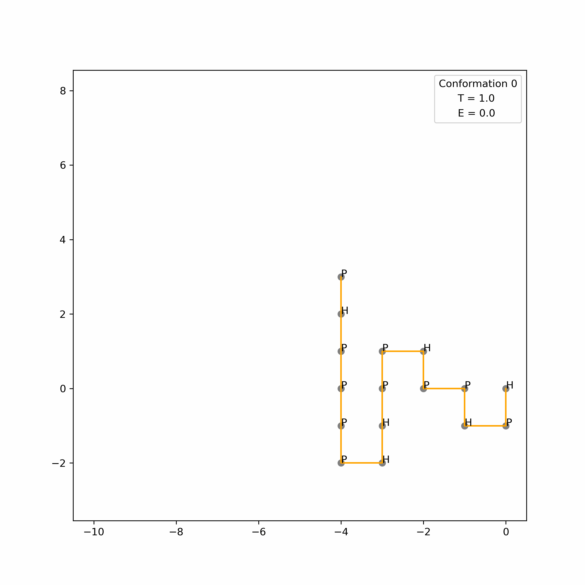

# Replica Exchange Monte Carlo algorithm reimplementation
The goal of this project was to reproduce the REMC algorithm:   

This project was made for the M2 Bioinformatics course in Université Paris Cité.  

## Authors

Roude JEAN MARIE  

## Script

We need to be located in the `src` directory and execute the specified commands :    

usage : ```python REMC [fastafile] [-o output_directory]  
	python REMC.py --help  # to get all available options
	```

Files will be generated in `./out/` directory if `-o` option value was not specified.  

## Import conda environment

`conda env create -f environment.yml`  

## REMC Algorithm

Given a protein sequence the goal is to apply a set of move to obtain an optimal conformation that will minize the energy of the conformation.
Only 2D coordinates are used in this project.  

## Some Results

  

